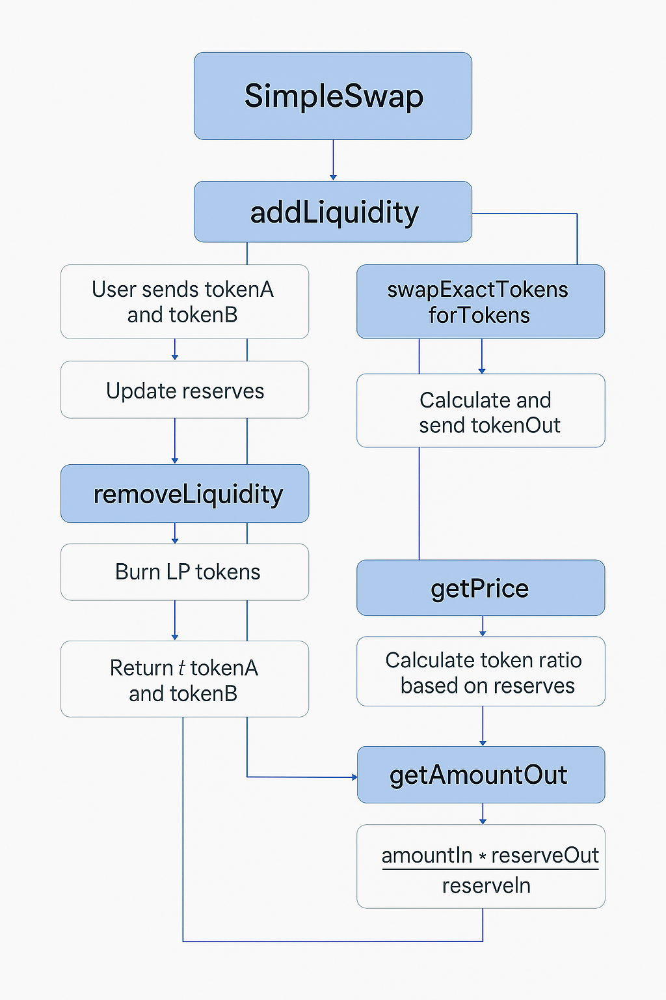

# SimpleSwap - Decentralized Token Swap Contract

# Trabajo Práctico Final - Módulo N° 3

---

## Table of Contents
- [Project Overview](#project-overview)
- [Smart Contract Flow](#smart-contract-flow)
- [Description](#description)
- [Prerequisites](#prerequisites)
- [Installation](#installation)
- [Deployment](#deployment)
- [Usage](#usage)
- [Contract Details](#contract-details)
- [Testing](#testing)
- [Pruebas pendientes / en progreso](#pruebas-pendientes--en-progreso)
- [Limitations](#limitations)
- [License](#license)

---

## Project Overview
SimpleSwap is a simplified decentralized exchange contract inspired by Uniswap V2, allowing users to add and remove liquidity, swap ERC20 tokens, and query token prices.
This project was developed as the final assignment for Module 3 of the Solidity course.

---
The contract implements essential functions such as:

**addLiquidity()**

**removeLiquidity()**

**swapExactTokensForTokens()**

**getPrice()**

**getAmountOut()**

---

## Smart Contract Flow

---
## Description

SimpleSwap allows users to:
- Add and remove liquidity from token pools
- Swap one ERC-20 token for another
- Get real-time prices based on reserves
- Calculate expected output amounts before swapping

The contract replicates basic Uniswap V2 logic without relying on the actual Uniswap protocol.

---

## Prerequisites

- Solidity version: 0.8.20
- Remix IDE for compiling and deploying contracts
- OpenZeppelin Contracts for ERC20 interface (imported locally)
- Metamask with Sepolia testnet configured

---

## Installation

1. Clone or download this repository.
2. Open Remix IDE (https://remix.ethereum.org).
3. Load the contract file 'SimpleSwap.sol'.
4. Select Solidity compiler version 0.8.20.
5. Enable optimizer with 200 runs.
6. Compile the contract.
7. Deploy the contract to the Sepolia testnet using injected Web3 provider (Metamask).

---

## Deployment

The contract was deployed on the **Sepolia testnet**, but could not be properly verified on Etherscan due to errors related to OpenZeppelin imports and compilation issues outside of Remix.

**Contract address on Sepolia (deployed from Remix)**:

(https://sepolia.etherscan.io/verifyContract-solc?a=0x93A0c1f7d6a9162C59C16678Fc31e9639AfeA5Fc&c=v0.8.20%2bcommit.a1b79de6&lictype=3)

**TokenA Contract**: 0x143Ce465ef5e2B1F3Fc3536C167Df7ac0f93D16C

**TokenB Contract**: 0xA6F2FF3c3268648F220E03403Cd32B5831A53944

---

## Usage

Use the following main functions:

**🔹addLiquidity(...)** : Adds liquidity to the token pool by depositing a pair of ERC20 tokens.

This function allows a user to provide liquidity by depositing two ERC20 tokens (Token A and Token B) into a liquidity pool.  
In exchange, the user receives LP tokens that represent their share of the pool.

By adding liquidity, the user enables others to swap tokens, and in return, earns a share of the swap fees.

**Tasks**:

    - Transfer tokens A and B from the user to the contract using transferFrom.
    - Calculate the optimal amounts of tokens to add to maintain the pool ratio.
    - Update the pool's internal reserves.
    - Issue liquidity tokens (LP tokens) to the user to represent their stake.
    - Validate that the transaction occurs before the deadline.
    - Apply minimum thresholds to prevent excessive slippage (amountAMin, amountBMin).

**Parameters:**

    address tokenA: Address of token A.

    address tokenB: Address of token B.

    uint256 amountADesired: Amount of token A the user wants to deposit.

    uint256 amountBDesired: Amount of token B the user wants to deposit.

    uint256 amountAMin: Minimum amount of token A accepted (slippage protection).

    uint256 amountBMin: Minimum amount of token B accepted (slippage protection).

    address to: Address that will receive the LP (liquidity provider) tokens.

    uint256 deadline: Timestamp after which the transaction will fail.

**Returns:**

    uint256 amountA: Actual amount of token A added. Amounts actually deposited (may be lower than the desired amount due to the ratio).

    uint256 amountB: Actual amount of token B added. Amounts actually deposited (may be lower than the desired amount due to the ratio).

    uint256 liquidity: Amount of LP tokens minted. Amount of LP tokens issued to the user.

---

**🔹 removeLiquidity(...)**: Removes liquidity from the pool, returning the underlying tokens to the user.

When users no longer want to participate as liquidity providers, they can burn their LP tokens (representing their share of the pool) and receive back the underlying ERC20 tokens (tokenA and tokenB) in proportion to their contribution.

**Parameters:**

address tokenA: Address of token A.

address tokenB: Address of token B.

uint256 liquidity: Amount of LP tokens to burn.

uint256 amountAMin: Minimum amount of token A to receive.

uint256 amountBMin: Minimum amount of token B to receive.

address to: Address to receive the tokens.

uint256 deadline: Timestamp after which the transaction will fail.

**Returns:**

uint256 amountA: Amount of token A returned.

uint256 amountB: Amount of token B returned.

************

**🔹removeLiquidity(...)**: Removes liquidity from the pool, returning the underlying tokens to the user.

When users no longer want to participate as liquidity providers, they can burn their LP tokens (representing their share of the pool) and receive back the underlying ERC20 tokens (tokenA and tokenB) in proportion to their contribution.

**Tasks**:

    - Burn the user's liquidity tokens (LP tokens).
    - Calculate the amounts of tokens A and B to return.
    - Transfer tokens A and B back to the user.
    - Validate that the transaction occurs before the deadline.
    - Apply minimum thresholds (amountAMin, amountBMin) to protect against slippage.

**Parameters:**

    address tokenA: Address of token A.

    address tokenB: Address of token B.

    uint256 liquidity: Amount of LP tokens to burn.

    uint256 amountAMin: Minimum amount of token A to receive (slippage protection).

    uint256 amountBMin: Minimum amount of token B to receive (slippage protection).

    address to: Address that will receive the withdrawn tokens.

    uint256 deadline: Timestamp after which the transaction will fail.

**Returns:**

    uint256 amountA: Amount of token A returned to the user.

    uint256 amountB: Amount of token B returned to the user.

---

**🔹 swapExactTokensForTokens(...)**: Swaps a fixed amount of input token for the maximum possible amount of output token, respecting minimum output and deadline.

This function allows a user to swap an exact amount of one ERC20 token (inputToken) for another ERC20 token (outputToken) within the liquidity pool. It guarantees that the user will receive at least a minimum amount of the output token (amountOutMin) to protect against price slippage, and the swap must happen before the specified deadline.

How it works:

- The user specifies exactly how many tokens they want to swap (amountIn).

- The contract calculates how many tokens the user will receive based on current pool reserves and the constant product formula.

- The function checks that the output amount is at least the minimum specified (amountOutMin) to avoid unexpected losses.

- If the swap conditions are met, the contract transfers the input tokens from the user, swaps them in the pool, and sends the output tokens to the recipient address (to).

- The deadline parameter prevents transactions from executing if too much time has passed, protecting the user from unfavorable price changes.

**Parameters:**

uint256 amountIn: Exact amount of input tokens to swap.

uint256 amountOutMin: Minimum amount of output tokens to receive.

address[] path: Array with two addresses — [inputToken, outputToken].

address to: Recipient address of output tokens.

uint256 deadline: Timestamp after which the transaction will fail.

**Returns:**

uint256[] amounts: Array with the input and output token amounts: [amountIn,amountOut].

---

**🔹 getPrice(...)**: Returns the current price of tokenA in terms of tokenB or vice versa, based on the reserves.

This function calculates and returns the current exchange rate between two ERC20 tokens, based on the liquidity pool reserves.
It answers the question: “How much of tokenB is needed to get 1 unit of tokenA?”

**It works bidirectionally:**

- If tokenA is the input and tokenB is the quote token, it returns the price of tokenA in terms of tokenB.

- If reversed, it returns the price of tokenB in terms of tokenA.

**Parameters:**

address tokenA: Address of token A.

address tokenB: Address of token B.

**Returns:**

uint256 price: Price of 1 unit of tokenA in terms of tokenB (scaled to 18 decimals).

---

**🔹 getAmountOut(...)**: Calculates the output amount a user would receive for a given input amount, using the AMM formula with swap fee.

This function calculates how many output tokens a user will receive when swapping a specific amount of input tokens, based on the current liquidity reserves in the pool and including the swap fee.

It uses the Automated Market Maker (AMM) formula, which keeps the product of the reserves constant, applying a fee (usually 0.3%) on the input amount to incentivize liquidity providers.

**How it works:**

- Takes the exact amount of input tokens the user wants to swap (amountIn).

- Considers the current reserves of both input (reserveIn) and output (reserveOut) tokens in the pool.

- Applies the swap fee by reducing the effective input amount.

- Calculates the maximum amount of output tokens the user can get while maintaining the pool’s constant product formula.

- Returns this calculated output amount (amountOut).

**Parameters:**

uint256 amountIn: The amount of tokens the user wants to swap into the pool.

uint256 reserveIn: Current reserve of the input token in the liquidity pool.

uint256 reserveOut: Current reserve of the output token in the liquidity pool.

**Returns:**

uint256 amountOut: The maximum amount of output tokens the user will receive after the swap and fee.

---

## Contract Details

Los contratos actuales están en la carpeta `SimpleSwap_v2/` y son:

- `SimpleSwapContract.sol`: contrato principal para swap y liquidez.
- `TokenAv1.sol`: token ERC20 personalizado A.
- `TokenBv1.sol`: token ERC20 personalizado B.
- Located in: `SimpleSwap_v2/` folder in the repository root
- Uses OpenZeppelin's 'IERC20' interface for token interaction.
- Implements key functions with detailed NatSpec comments.
- Designed to replicate basic Uniswap V2 functionality without external dependencies.

---

## Testing

- Functions were manually tested on the Sepolia testnet with deployed ERC20 tokens.
- All transactions were verified in Remix and on Sepolia blockchain explorer.
- Due to Remix import limitations, contract verification on Etherscan was unsuccessful.

---

## Pending/In-Progress Tests

- 'swapExactTokensForTokens()' and 'removeLiquidity()' are being tested.
- Results, screenshots, and edge analysis will be added soon.

---  

## Limitations

- OpenZeppelin imports could not be verified on Etherscan due to import callback restrictions in Remix.
- Swap fee is fixed and simplified.
- Does not implement advanced Uniswap features like flash swaps or multi-hop swaps.

---
## License

This project is licensed under the MIT License © 2025

---
Made by: [Ivana Papaño](https://github.com/IvanaPapanio3190)

---
